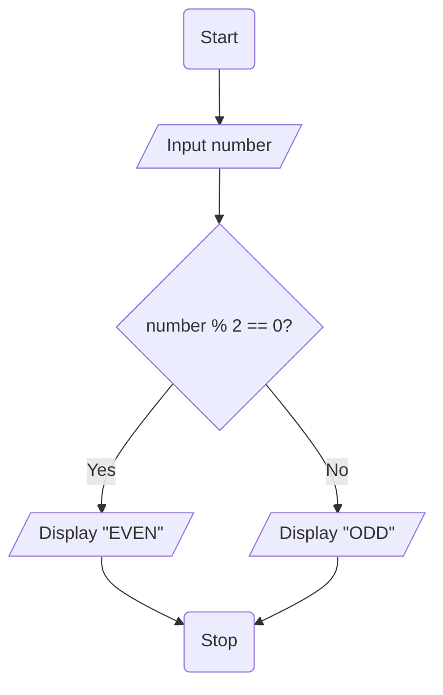
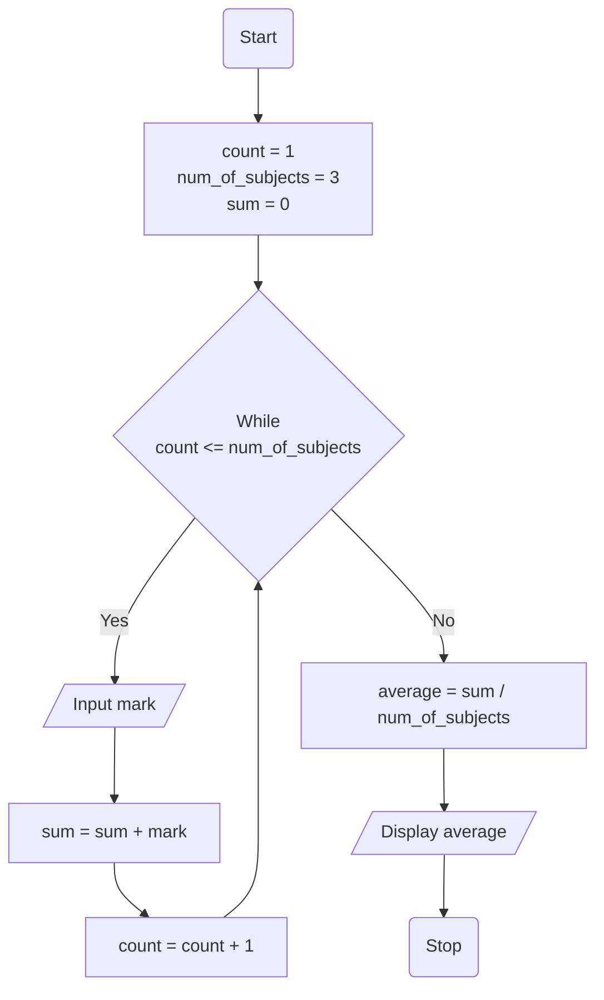
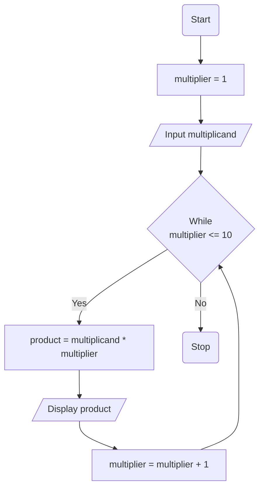
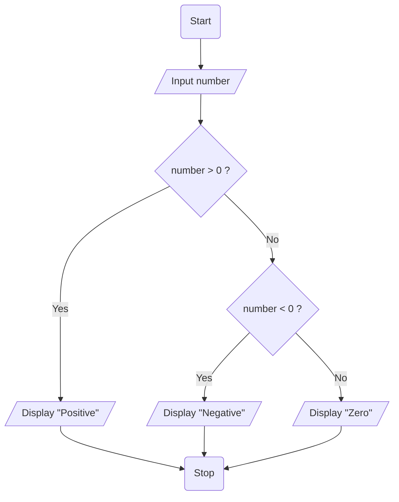

# Workshop: Algorithm and Flowchart

## 1. Check Even or Odd Number

Design an algorithm and flowchart that take a number as input and
determine whether it is even or odd.

### Pseudocode

```text
START
    INPUT number
    IF number % 2 == 0 THEN
        PRINT Even
    ELSE
        PRINT Odd
    ENDIF
END
```

### Flowchart

[View Flowchart](images/Q1.drawio.png)



---

## 2. Calculate Total and Average Marks

Write the algorithm and draw the flowchart for a program that inputs
marks for 3 subjects, calculates the total and average, and displays
both.

### ✔ Pseudocode

```text
START
    SET count = 1, num_of_subjects = 3, sum = 0
    WHILE count <= num_of_subjects DO
        INPUT mark
        sum = sum + mark
        count = count + 1
    END WHILE
    average = sum / num_of_subjects
    PRINT average
END
```

### ✔ Flowchart

[View Flowchart](images/Q2.drawio.png)


---

## 3. Display Multiplication Table

Create an algorithm and flowchart that input a number and display its
multiplication table from 1 to 10 using a loop.

### ✔ Pseudocode

```text
START
    SET multiplier = 1
    INPUT multiplicand
    WHILE multiplier <= 10 DO
        product = multiplicand * multiplier
        PRINT multiplicand, " x ", multiplier, " = ", product
        multiplier = multiplier + 1
    END WHILE   
END
```

### ✔ Flowchart

[View Flowchart](images/Q3.drawio.png)



---

## 4. Positive, Negative, or Zero Check

Write the algorithm and flowchart to input a number and display whether
it is positive, negative, or zero.

### ✔ Pseudocode

```text
START
    INPUT number
    IF number > 0 THEN
        PRINT number, ": Positive Number"
    ELSE IF number < 0 THEN
        PRINT number, ": Negative Number"
    ELSE
        PRINT number, ": Zero"
    END IF
END
```

### ✔ Flowchart

[View Flowchart](images/Q4.drawio.png)



---

## 5. Simple Interest Calculator

Create an algorithm and flowchart for a program that calculates simple
interest using the formula:

**SI = (P × R × T) / 100**

- **P = Principal** → original amount of money
- **R = Rate of Interest** → percentage per year
- **T = Time** → number of years

### ✔ Pseudocode

```text
START
    INPUT principal
    INPUT rate
    INPUT time
    SI = (principal x rate x time) / 100
    PRINT "Simple Interest = ", SI    
END
```

### ✔ Flowchart

[View Flowchart](images/Q5.drawio.png)

```mermaid
flowchart TD
    A(Start) --> B[/Input principal, rate, time/]
    B --> C[SI = (principal * rate * time) / 100]
    C --> D[/Display SI/]
    D --> E(Stop)
```
---

## 6. Average Temperature Calculation

Write the algorithm and draw the flowchart for a program that takes the
temperature of 7 days, finds the average temperature, and displays it.

### ✔ Pseudocode

```text
START
    SET day = 1, num_of_days = 7, total_temperature = 0
    WHILE day <= num_of_days DO
        INPUT temperature
        total_temperature = total_temperature + temperature
        day = day + 1
    END WHILE
    average_temperature = total_temperature / num_of_days
    PRINT average_temperature   
END
```

### ✔ Flowchart

[View Flowchart](images/Q6.drawio.png)

```mermaid
flowchart TD
    A(Start) --> B[day = 1<br>num_of_days = 7<br> total_temperature = 0]
    B --> C{While<br>day <= num_of_days}
    C -- Yes --> D[/Input temperature/]
    D --> E[total_temperature = total_temperature + temperature]
    E --> F[day = day + 1]
    F --> C
    C -- No --> G[average_temperature = total_temperature / num_of_days]
    G --> H [/Display average_temperature/]
    H --> I(Stop)
```

---

## 7. Calculate Area of a Rectangle

Create an algorithm and flowchart to input length and width, calculate
the area (**Area = Length × Width**), and display the result.

### ✔ Pseudocode

```text
START
    INPUT length
    INPUT width
    area = length * width
    PRINT "Area of rectangle = ", area
END
```

### ✔ Flowchart

[View Flowchart](images/Q7.drawio.png)

```mermaid
flowchart TD
    A(Start) -->
```

---

## 8. Determine Pass or Fail

Write the algorithm and draw the flowchart for a program that takes a
student's average marks and displays **"Pass"** if average ≥ 50,
otherwise **"Fail"**.

### ✔ Pseudocode

```text
START
    INPUT average_mark
    IF average_mark >= 50 THEN
        PRINT "Student is Pass"
    ELSE
        PRINT "Student is Fail"
    END IF
END
```

### ✔ Flowchart

[View Flowchart](images/Q8.drawio.png)

```mermaid
flowchart TD
    A(Start) -->
```

---

## 9. Calculate Factorial of a Number

Write the algorithm and draw the flowchart that input a number and
calculate its factorial using a loop.

### ✔ Pseudocode

```text
START
    INPUT number
    SET factorial = 1
    SET count = number
    WHILE  count >= 1 DO
        factorial = factorial * count
        count = count - 1
    END WHILE
    PRINT factorial
END
```

### ✔ Flowchart

[View Flowchart](images/Q9.drawio.png)

```mermaid
flowchart TD
    A(Start) -->
```

---

## 10. Calculate Discount on Purchase

Write the algorithm and draw the flowchart for a program that inputs the
purchase amount and gives a **10% discount** if the amount is greater
than 1000.

### ✔ Pseudocode

```text
START
    INPUT purchase_amount
    SET discount = 0
    IF purchase_amount > 1000 THEN
        discount = purchase_amount * 10 / 100
    ENF IF
    PRINT "You got a discount of : SEK", discount
END
```

### ✔ Flowchart

[View Flowchart](images/Q10.drawio.png)

```mermaid
flowchart TD
    A(Start) -->
```

---
